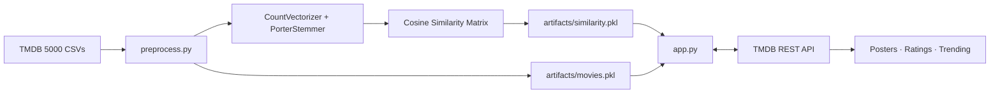

# Movie Recommender System

Content-based movie recommendation engine with a Streamlit web interface, powered by the TMDB 5000 dataset.

**Live demo:** https://bo6fqwrhupbw9c728dsf2d.streamlit.app/


## Features

- Content-based filtering using cosine similarity on movie metadata
- Movie posters, ratings, and release year fetched live from the TMDB API
- Trending movies section on the home screen (requires API key)
- Adjustable number of recommendations (5–15)
- Concurrent poster fetching for fast page loads
- Preprocessing pipeline to rebuild all artifacts from raw TMDB CSV data

## Architecture



## How It Works

1. **Feature engineering** — genres, cast, crew, keywords, and overview are merged into a single `tags` string per movie, lowercased, and stemmed with a Porter stemmer.
2. **Vectorization** — tags are converted to count vectors using `CountVectorizer` with a vocabulary capped at 5 000 words.
3. **Similarity** — cosine similarity is computed between every pair of movie vectors and stored as a square matrix.
4. **Recommendation** — for a selected movie, the top-N highest-scoring neighbours are returned (excluding the movie itself).

## Project Structure

```
Movie_Recommender_System/
├── src/
│   ├── config.py          # paths, constants, and environment settings
│   ├── fetcher.py         # TMDB API wrapper (details + trending)
│   └── recommender.py     # artifact loading and recommendation logic
├── artifacts/
│   └── movies.pkl         # preprocessed movie dataframe (4 806 movies)
├── app.py                 # Streamlit web application
├── preprocess.py          # CLI pipeline to rebuild artifacts from raw data
├── requirements.txt
├── .env.example
└── README.md
```

> `artifacts/similarity.pkl` (~200 MB) is excluded from the repository and is downloaded automatically on first run from Google Drive.

## Setup

### 1. Clone and install

```bash
git clone https://github.com/punyamodi/Movie_Recommender_System.git
cd Movie_Recommender_System
pip install -r requirements.txt
```

### 2. Configure the TMDB API key

Create a `.env` file from the example and add your [TMDB API key](https://www.themoviedb.org/settings/api):

```bash
cp .env.example .env
```

```
TMDB_API_KEY=your_tmdb_api_key_here
```

The app works without a key but will display placeholder images and skip the trending section.

### 3. Run the app

```bash
streamlit run app.py
```

The similarity matrix is downloaded automatically on first launch (~200 MB). Subsequent runs load it from disk.

### Rebuild artifacts (optional)

Download the TMDB 5000 dataset from [Kaggle](https://www.kaggle.com/datasets/tmdb/tmdb-movie-metadata) and run:

```bash
python preprocess.py \
  --movies  path/to/tmdb_5000_movies.csv \
  --credits path/to/tmdb_5000_credits.csv
```

This regenerates both `artifacts/movies.pkl` and `artifacts/similarity.pkl`.

## Tech Stack

| Layer | Technology |
|---|---|
| Web framework | Streamlit |
| Data processing | pandas, NumPy |
| NLP | NLTK (Porter stemmer) |
| ML | scikit-learn (CountVectorizer, cosine similarity) |
| Movie metadata | TMDB API |
| Configuration | python-dotenv |

## Dataset

The [TMDB 5000 Movie Dataset](https://www.kaggle.com/datasets/tmdb/tmdb-movie-metadata) contains ~5 000 movies with genres, cast, crew, keywords, and plot overviews. After merging and cleaning, 4 806 movies remain.


